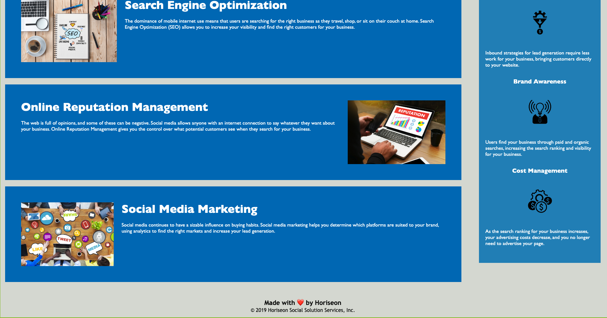

# Week 1 Homework: Code Refactor

## Description
I went through and tried to replace all the div elements with semantic HTML elements.  I attempted to use the elements that I thought fit the section.  The images had to be moved into a different file and connected in a different way, then the alt attributes were added. To the best of my ability the heading is in sequential order and the title is concise and simple.

## Screenshot

## Link 